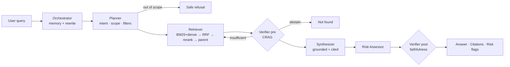

# LegalRAG — Multi-Agent RAG for Legal Contract Analysis

A console **and** web assistant that answers natural-language questions about a corpus
of legal contracts (NDA, vendor/service agreement, SLA, DPA) with **grounded, cited
answers** and **risk flags** — multi-turn, fully local via Ollama.

> **Not legal advice.** Decision-support only; every answer is traceable to a clause.

---

## TL;DR

- **What it does** — ask things like *"What is the notice period for terminating the
  NDA?"*, *"Are there conflicting governing laws across agreements?"*, or *"Summarize
  all risks for Acme."* Get an answer, the **exact clauses it's based on**, and
  **severity-ranked risk flags**.
- **How** — a **6-agent** pipeline: Orchestrator → Planner (intent + scope guardrail +
  filters) → Retriever (hybrid BM25 + `bge-m3` dense → RRF → cross-encoder rerank →
  parent-child) → Verifier (CRAG grading + corrective loop) → Synthesizer (grounded +
  cited) → Risk Assessor → Verifier (Self-RAG faithfulness).
- **Trust-first** — it **abstains** ("Not found in the provided contracts") when the
  corpus lacks the answer, and **refuses** out-of-scope asks (drafting / legal
  strategy). In legal QA a confident wrong answer is the worst outcome.
- **Runs anywhere** — fully offline test/dev path (no model download), local Ollama for
  real answers, single-container **RunPod** deploy for a GPU demo.
- **Evaluated, not vibes** — labeled `qrels` + ablations (recall@k / MRR / nDCG) and a
  system eval (routing / refusal / abstention / risk-recall). **41 tests** pass offline.

## Results (real 4-doc corpus)

**Retrieval ablation** — the cross-encoder is the only config that beats the lexical
baseline, and it wins at **rank 1** (what matters when the LLM reads the top passages):

| config | recall@1 | recall@5 | MRR | nDCG@5 |
|---|---|---|---|---|
| baseline (hash embed + lexical) | 0.580 | 0.849 | 0.856 | 0.797 |
| bge-m3 + lexical | 0.513 | 0.816 | 0.833 | 0.770 |
| **bge-m3 + cross-encoder** | **0.624** | 0.804 | **0.867** | 0.793 |

**System eval** (19 queries = 17 sample + 2 adversarial no-answer):

| routing | doc-hit | clause-hit | refusal | abstention | risk-recall |
|---|---|---|---|---|---|
| **1.00** | 0.90 | **1.00** | **1.00** | 0.88 | 0.83 |

Full analysis and the run-by-run log live in **[findings.md](./findings.md)**.

## Quickstart

```bash
python3 -m venv venv && source venv/bin/activate
pip install -r requirements.txt          # local/dev (offline path)

# --- fully offline (no Ollama, no downloads): great for tests / a quick look ---
python main.py --ingest --backend fake
python main.py --search "uptime commitment in the SLA?" --backend fake --reranker lexical

# --- real models via Ollama ---
ollama pull bge-m3 && ollama pull qwen2.5:14b-instruct
pip install -r requirements-deploy.txt   # adds the cross-encoder (sentence-transformers + torch)
python main.py --ingest --backend ollama
python main.py --backend ollama          # interactive console
python main.py --serve                   # web UI at http://localhost:8000
```

Drop your own contracts (`.txt`, `.md`, `.pdf`, `.docx`) into `data/contracts/` and
re-run `--ingest`.

## Commands

| command | what it does |
|---|---|
| `--ingest` | parse → chunk → embed → build the hybrid index |
| `--search "..."` | retrieve evidence for a query (no LLM) |
| *(no flag)* | interactive multi-turn console |
| `--serve` | FastAPI web app (chat UI + `/ask` + `/docs`) |
| `--eval` | system eval (routing / refusal / abstention / risk) |
| `--retrieval-eval` | recall@k / MRR / nDCG vs `qrels` |
| `--ablation` | compare embedder × reranker configs |

Flags: `--backend ollama|fake`, `--reranker cross_encoder|lexical`, `-k N`.

## Architecture



Six agents, each owning a distinct **failure mode** (no decorative agents). Design
rationale, prompt templates, and the per-query walkthrough are in
**[docs/DESIGN.md](./docs/DESIGN.md)** and **[docs/DESIGN_RATIONALE.md](./docs/DESIGN_RATIONALE.md)**.

## RAG choices

| Decision | Choice | Why |
|---|---|---|
| Chunking | structure-aware **parent-child** + context cue (SAC) | search the small precise child, hand the LLM the parent section; the cue fights document-level mismatch |
| Embeddings | **`bge-m3`** (Ollama) | dense+sparse from one model, 8k ctx, local/private; legal-tuned swap noted for prod |
| Retrieval | hybrid **BM25 + dense → RRF → cross-encoder** | exact terms *and* paraphrase; rank fusion needs no score normalization |
| LLM | **`qwen2.5:14b-instruct`** (Ollama) | strong instruction-following + JSON; provider-agnostic seam (Ollama→vLLM/OpenAI) |
| Determinism | temp 0–0.1, fixed seed, JSON mode, token caps | reproducible, concise legal answers |

## Evaluation & metrics

`eval/` ships a labeled **`qrels`** (gold clause per query), pure-function ranking
metrics (`recall@k`, `precision@k`, `MRR`, `nDCG@k`), a **gold set** (17 sample queries
+ adversarial no-answer cases), and an **ablation runner**. What we measure and *why*:
document-level retrieval accuracy (the #1 legal failure: right clause, wrong contract),
faithfulness + citation correctness, and **abstention/refusal accuracy**. Limitations
(tiny corpus, LLM-as-judge, no attorney ground truth) are stated in
[docs/DESIGN.md](./docs/DESIGN.md) §5.

## Web app

FastAPI wraps the orchestrator with a chat UI (answer + citations + severity-ranked
risk flags, multi-turn). `POST /ask {query, session_id}` →
`{answer, citations, risk_flags, intent, abstained, refused}`. Config via env:
`LEGALRAG_BACKEND`, `LEGALRAG_RERANKER`, `LEGALRAG_INDEX_DIR`.

## Deployment (RunPod GPU)

One Docker image bundles Ollama (`bge-m3` + `qwen2.5`) + the cross-encoder + the web app
on port 8000. Step-by-step (Docker and no-Docker paths, GPU sizing, model caching) in
**[docs/DEPLOY_RUNPOD.md](./docs/DEPLOY_RUNPOD.md)**.

## Adding documents & other jurisdictions

- **New document** — drop it in `data/contracts/`, re-run `--ingest`, restart the app.
  v1 rebuilds the whole index (idempotent; instant for a small corpus). Incremental
  ingestion for large corpora is the production path (DESIGN §9).
- **Different jurisdiction (e.g. Indian law)** — retrieval, grounding, and citations are
  jurisdiction-agnostic and work. Clause tagging and the risk taxonomy are
  English-keyword and **finite**, so jurisdiction-specific risks aren't auto-flagged, and
  legal *correctness* isn't guaranteed (the not-a-lawyer disclaimer holds). An unrelated
  doc won't corrupt answers — the verifier abstains when nothing relevant is retrieved.

## Scaling (4 → 10k+ docs)

Point/clause queries scale by swapping the dev store for an ANN vector DB (Qdrant /
pgvector) with document-level routing. **Corpus-wide analytical** queries ("all risks",
"conflicting laws across agreements") don't scale as pure retrieval — they need a
**structured knowledge layer** built at ingestion (extract key fields + pre-computed
risk flags → metadata aggregation). Full treatment in [docs/DESIGN.md](./docs/DESIGN.md) §9.

## Project layout

```
legal_rag/
  config/      typed settings (models, k's, temperatures, backends)
  ingestion/   parser → chunker (parent-child + SAC) → indexer · clause_tags
  retrieval/   bm25 · dense · fusion(rrf) · rerank · store
  llm/         provider-agnostic client (ollama|fake) · embeddings
  agents/      orchestrator · planner · retriever · synthesizer · risk · verifier · prompts/
  memory/      session state + history-aware rewrite
  eval/        qrels · retrieval_metrics · retrieval_eval · ablation · gold_set · runner
  web/         FastAPI app · service layer · static chat UI
  app.py       wiring (build the agent graph)
main.py        CLI entry point (ingest / search / serve / eval / ablation)
data/contracts/  the corpus you query
tests/         offline suite (41 tests) · fixtures/ = frozen test corpus
docs/          DESIGN · DESIGN_RATIONALE · DEPLOY_RUNPOD
findings.md    evaluation log (runs, ablations, fixes)
APPROACH.md    end-to-end narrative (problem → design → build → eval → deploy)
Dockerfile · docker/entrypoint.sh   RunPod image
```

> `tests/fixtures/contracts/` is a **frozen copy** of the corpus so the test suite stays
> green even after you change `data/contracts/` — it is test infrastructure, not data to query.

## Known limitations

No licensed-attorney validation — **decision-support, not legal advice**. Digital-text
documents only (no OCR in v1). The risk taxonomy is curated and finite. Clause tagging is
English-keyword. Evaluation is directional on a tiny corpus. See [docs/DESIGN.md](./docs/DESIGN.md) §8.
